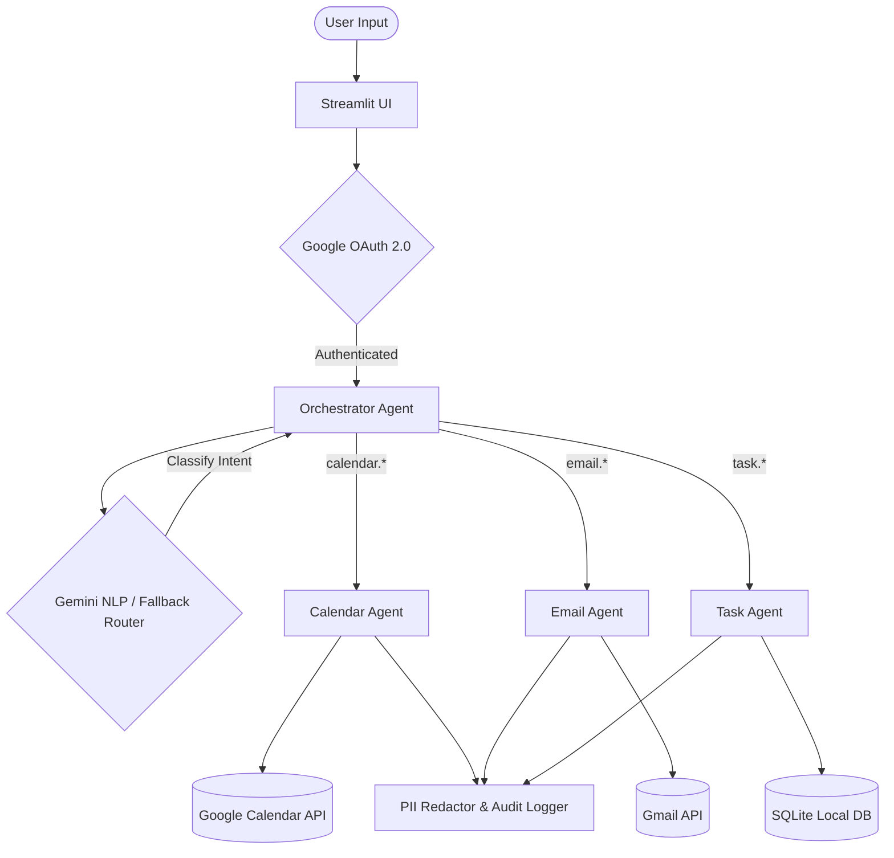

# LifeOS: The AI-Powered Personal Command Center

## 🌟 Project Overview
LifeOS is an intelligent, multi-agent personal command center designed to seamlessly coordinate your calendar, email, and task workflows through a conversational AI interface. Built as a powerful scaffold during the Google AI Hackathon, LifeOS transforms how users interact with their daily lives by replacing clunky UIs with natural language processing.

Instead of navigating through multiple apps to check your schedule, read emails, or jot down tasks, you simply talk to LifeOS. Powered by Google's state-of-the-art **Gemini** model, LifeOS intelligently determines your intent and delegates actions to specialized domain agents (Calendar, Email, and Tasks).

## 🚀 Key Features
* **Semantic Intent Routing**: Speak naturally! Instead of rigid commands, LifeOS uses a custom NLP router (and Gemini AI capabilities) to translate natural phrases like *"I need to remember to buy eggs"* into precise `task.add` API calls.
* **Direct Google API Integration**: Securely connects to your real Google Account using OAuth 2.0 to fetch live calendar events and search your Gmail inbox.
* **Multi-Agent Architecture**: 
  * 🧠 **Orchestrator Agent**: The brain of the operation that classifies intent and delegates tasks.
  * 📅 **Calendar Agent**: Interfaces with the Google Calendar API to list events, find free slots, and create meetings.
  * 📧 **Email Agent**: Interfaces with the Gmail API to search threads, read emails, and draft replies.
  * 📝 **Task Agent**: Manages a local SQLite database for instant, offline task tracking.
* **Privacy-First Security**: Built-in PII redaction and audit logging ensures that sensitive user data is scrubbed before being logged or processed.

## 🏗️ Architecture Flowchart

## 🛠️ Technology Stack
* **Frontend**: Streamlit (Python) for a clean, responsive chat interface.
* **AI Model**: Google Gemini (`gemini-1.5-flash` / `gemini-2.0-flash`) via the `google-genai` SDK.
* **Backend Integrations**: Google OAuth 2.0, Google Calendar API (`v3`), Gmail API (`v1`).
* **Database**: Local SQLite for task persistence.

## 💡 How We Built It
We started with a basic hackathon scaffold utilizing placeholder Model Context Protocol (MCP) servers. Recognizing the need for immediate, real-world utility, we ripped out the fake backend proxies and wired the agents *directly* into the official Google APIs using `googleapiclient`. 

When we hit quota limits with the newest Gemini 2.0 models, we rapidly engineered a **Strong Deterministic Fallback Router**. This robust regex-based NLP engine allows the app to continue functioning seamlessly offline or without API credits by understanding a massive array of synonyms and natural language patterns.

## 🎯 What's Next?
The current modular architecture is designed for infinite expandability. Future plans include adding more specialized agents (e.g., a Finance Agent, a Fitness Agent), deploying the app to the cloud for persistent access, and implementing voice-to-text for a completely hands-free personal assistant experience!
