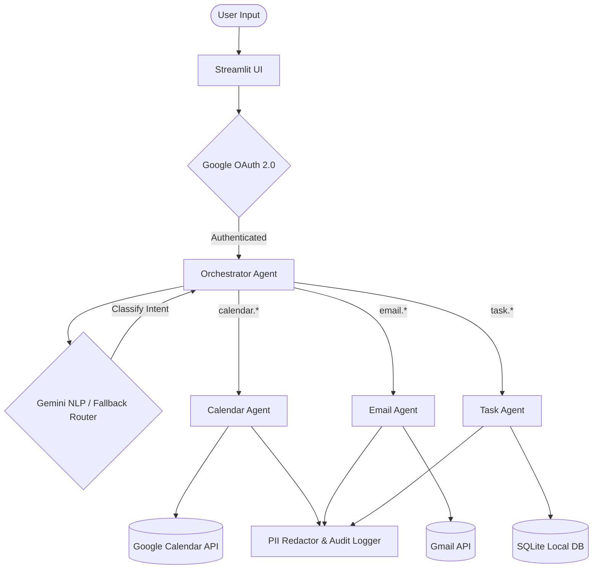

# LifeOS — Personal Command Center

LifeOS is a multi-agent personal command center that seamlessly coordinates your calendar, email, and task workflows through a conversational AI interface. 

Built as a submission for the Google AI Hackathon, this project uses the Gemini AI model to process natural language and execute commands across your personal Google ecosystem.

## 🌟 What’s Included

- **AI Orchestrator**: Uses Google Gemini to semantically route natural language to the correct agent.
- **Calendar Agent**: Connects directly to Google Calendar API to fetch events and find free time.
- **Email Agent**: Connects directly to the Gmail API to search unread emails and draft replies.
- **Task Agent**: Local SQLite database integration for fast, offline task tracking.
- **Streamlit UI**: A clean, responsive chat interface for interacting with the AI.
- **Security & Privacy**: Built-in PII redaction and audit logging.

## 🚀 Quick Start

1. **Clone the repository and navigate to the directory.**
2. **Install dependencies:**
   ```bash
   pip install -r requirements.txt
   ```
3. **Configure your `.env` file:**
   Create a `.env` file in the root directory (you can copy `.env.example`). Ensure the following variables are set:
   ```env
   LIFEOS_MODEL=gemini-1.5-flash
   LIFEOS_OAUTH_CLIENT_SECRET_FILE=credentials.json
   LIFEOS_TASK_DB=tasks.db
   ```
4. **Setup Google OAuth:**
   Download your Google Cloud Desktop App OAuth `credentials.json` file and place it in the root directory. 
   Run the initial login script to authorize your account:
   ```bash
   python login.py
   ```
5. **Launch the app:**
   ```bash
   streamlit run lifeos/ui/app.py
   ```

## 🧠 Architecture & Agents



- `lifeos/agents/orchestrator.py`: The central brain. Parses natural language and delegates commands.
- `lifeos/agents/adk_wrapper.py`: The Gemini/NLP intent classifier. Includes a robust deterministic fallback engine if the API is unavailable.
- `lifeos/agents/calendar_agent.py`: Direct Google API integration for Calendar operations.
- `lifeos/agents/email_agent.py`: Direct Google API integration for Gmail operations.
- `lifeos/ui/app.py`: The Streamlit chat interface.

## 🔒 Security Notes

- Credentials are environment-based and should not be committed to source control.
- PII redaction and audit logging are built into the core (`lifeos/security/`).
- OAuth tokens are stored locally in `lifeos/database/tokens.json` for reuse.

## 🛠️ Development

This repository uses a modular architecture. You can easily extend LifeOS by creating new Agents in the `agents/` directory and adding new intent routes in the `orchestrator.py` file.
